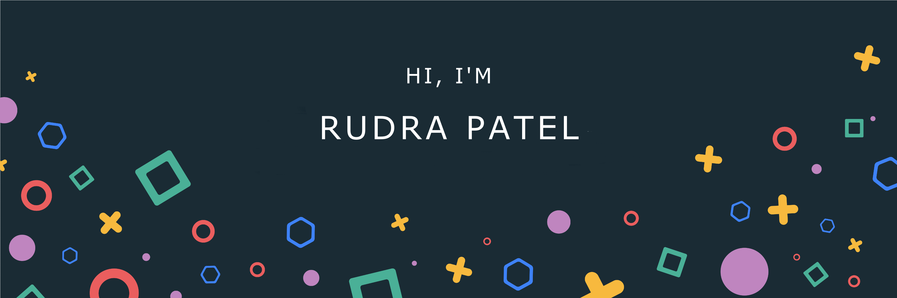

<h3 align="center">A ML enthusiast and also an engineering student at Manipal Institute of Techonology</h4>

  

  <h2 align="center"> 📊 Github stats </h2>
     
      

        
      

      

        
     

    

    

  <h2 align="center"> my current activity </h2>
<!--  -->

  <samp>
    <h2 align="center">you can reach me by:</h2>
    

       
      
      
    

  
  </samp>

